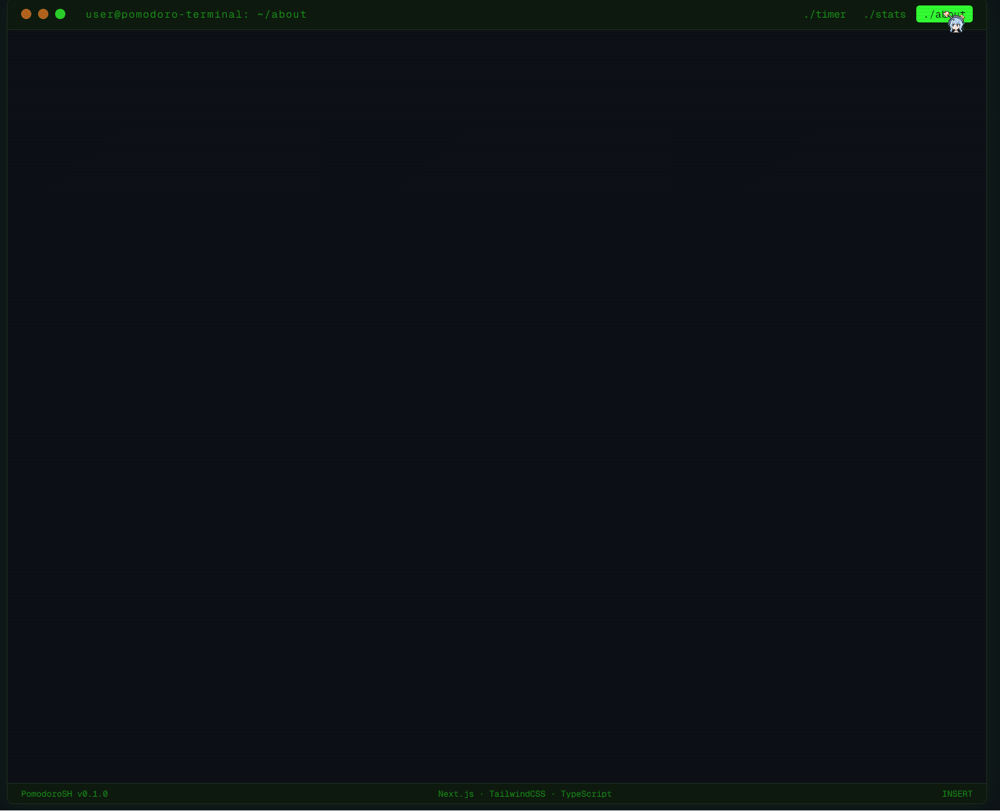

# PomodoroSH

## Preview



## Project Description

PomodoroSH is a Pomodoro timer built for students who want to stay in flow. This Timer helps students balance their work sessions and breaks, track your progress over time, and manage task lists, with the design of a linux terminal-inspired interface.

## Planned Features

1. timer— 25-min work sessions, 5-min short breaks, 15-min long breaks
2. sessions— Track completed pomodoros with daily/weekly stats & streaks
3. tasks— Add tasks, assign pomodoro estimates, mark them complete
4. settings— Configure durations, auto-start, and persist across sessions
5. notify— Browser notifications + ambient sounds (rain, white noise, lo-fi)

## Tech Stack

- Next.js
- React
- TypeScript
- TailwindCSS

## Getting Started

### Prerequisites

- Node.js 18+
- npm or yarn

### Installation

```bash
# Clone the repository
git clone https://github.com/Yousor0/pomodoro-terminal.git
cd pomodoro-terminal

# Install dependencies
npm install

# Start the development server
npm run dev
```

Open [http://localhost:3000](http://localhost:3000) in your browser.

### Build for Production

```bash
npm run build
npm start
```

## Deployment

PomodoroSH is deployed on [Vercel](https://vercel.com). The live site is available at:

<!-- Replace with your actual Vercel deployment URL -->

**[https://pomodoro-terminal.vercel.app](https://pomodoro-terminal.vercel.app)**

### Deploy Your Own

[](https://vercel.com/new/clone?repository-url=https://github.com/your-username/pomodoro-terminal)

Or manually via the Vercel CLI:

```bash
npm install -g vercel
vercel
```

Vercel will auto-detect the Next.js project and configure the build settings. Every push to `main` triggers a new production deployment.
